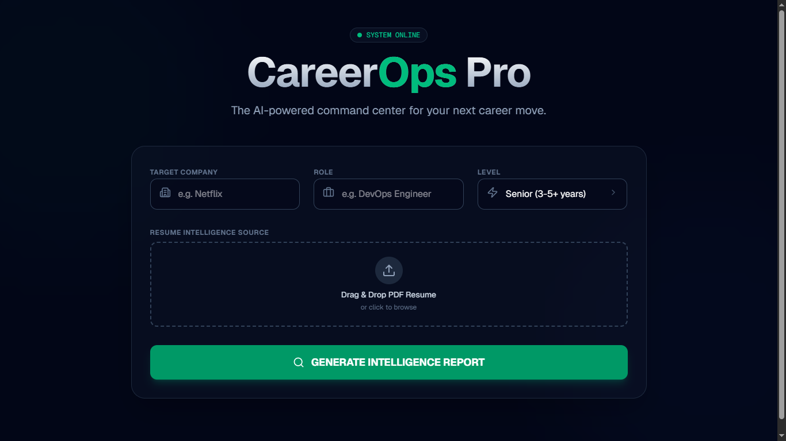
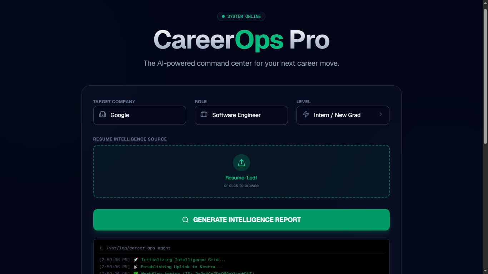
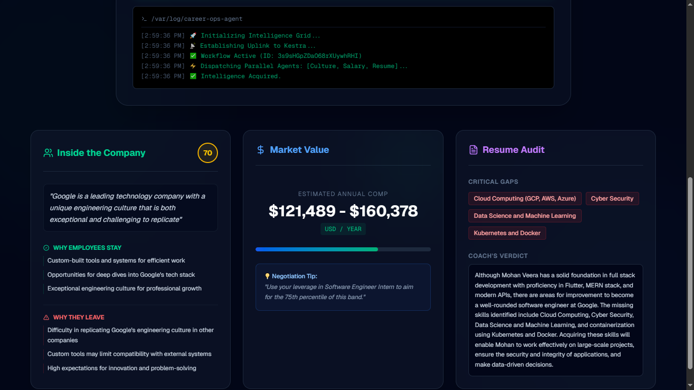
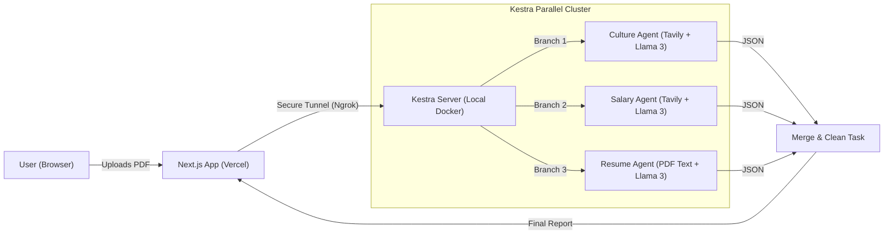

# 🚀 CareerOps Pro
> **360° Career Intelligence Dashboard powered by Parallel AI Agents.**
> *(Formerly "Insight Scout" - Pivoted to Career Intelligence)*


<div align="center">
  <a href="./public/screenshots/dashboard.png">
    
  </a>

  <br />

  <a href="./public/screenshots/demo1.png">
    
  </a>
  &nbsp;
  <a href="./public/screenshots/demo2.png">
    
  </a>
</div>

## 💡 The Problem
Modern job searching is a black box. Candidates often apply blindly without knowing:
1.  **Culture:** Is the company toxic or supportive?
2.  **Market Value:** Am I being underpaid compared to real-time market data?
3.  **Resume Gaps:** Why am I getting rejected by ATS systems?

## 🛠️ The Solution: CareerOps Pro
CareerOps Pro is an AI-powered command center that orchestrates **3 autonomous AI agents in parallel** to deliver a comprehensive "Battle Card" for any job application in seconds.

### 🌟 Key Features
* **🕵️ Culture Scout Agent:** Scrapes real-time news and employee reviews to identify "Green Flags" (Perks) and "Red Flags" (Burnout risks).
* **💰 Salary Analyst Agent:** Aggregates live compensation data from Glassdoor & Levels.fyi to estimate accurate salary bands for your specific level.
* **📄 Resume Auditor Agent:** Uses semantic analysis to compare your uploaded PDF against the target role, identifying critical skill gaps.
* **⚡ Parallel Orchestration:** Powered by **Kestra**, all agents run simultaneously, reducing analysis time by 60%.

---

## 🏗️ Architecture: Hybrid Cloud Strategy

We utilize a **Hybrid Architecture** to combine the power of local orchestration with the accessibility of the cloud.



### ⚠️ Important Note on Live Demo

**Please Read:** The frontend is deployed on **Vercel** for global access, but the orchestration engine (**Kestra**) runs on a local Docker container to leverage local resource management.

We use **Ngrok** to create a secure tunnel between Vercel and our local machine.

> **If the local Docker container or Ngrok tunnel is stopped, the live Vercel demo will not function.** \> Please refer to the **Demo Video** for a guaranteed walkthrough of the system capabilities.

-----

## ⚙️ Tech Stack

  * **Frontend:** Next.js 14 (App Router), Tailwind CSS, Shadcn UI (Glassmorphism Design).
  * **Orchestration:** Kestra (Docker).
  * **AI Models:** Llama 3.3 (via Groq), Tavily (Real-time Search).
  * **Infrastructure:** Vercel (Frontend Hosting), Ngrok (Tunneling).
  * **Utilities:** `pdfjs-dist` (Client-side PDF parsing), `lucide-react` (Icons).

-----

## 🚀 Local Setup Guide

Follow these steps to run the full system on your machine.

### Prerequisites

  * Node.js 18+
  * Docker & Docker Compose
  * Ngrok (Free account)

### 1\. Clone the Repository

```bash
git clone [https://github.com/shyamsundaravssb/insight-scout.git](https://github.com/shyamsundaravssb/insight-scout.git)
cd insight-scout
npm install
```

### 2\. Setup Kestra (Backend)

1.  **Start Kestra:** Ensure Docker is running.
    ```bash
    docker-compose up -d
    ```
2.  **Access UI:** Open `http://localhost:8080`.
3.  **Import Flow:**
      * Navigate to the `kestra/` folder in this repo.
      * Copy the content of `career-ops-pro.yaml`.
      * Create a new flow in the Kestra UI and paste the code.
4.  **Add Secrets:**
      * Go to **Namespaces** -\> `dev` -\> **KV Store / Variables**.
      * Add `GROQ_API_KEY` (Get from [Groq Console](https://console.groq.com)).
      * Add `TAVILY_API_KEY` (Get from [Tavily](https://tavily.com)).

### 3\. Setup Tunnel (Ngrok)

To allow the frontend to talk to Kestra, start a tunnel.

```bash
ngrok http 8080
```

*Copy the Forwarding URL (e.g., `https://your-id.ngrok-free.app`).*

### 4\. Run Frontend

Create a `.env.local` file in the root directory:

```env
KESTRA_BASE_URL=[https://your-id.ngrok-free.app/api/v1](https://your-id.ngrok-free.app/api/v1)
KESTRA_FLOW_URL=[https://your-id.ngrok-free.app/api/v1/executions/dev/career-ops-pro](https://your-id.ngrok-free.app/api/v1/executions/dev/career-ops-pro)
KESTRA_USERNAME=admin@hackathon.com
KESTRA_PASSWORD=Hackathon123
```

Run the development server:

```bash
npm run dev
```

Open [http://localhost:3000](https://www.google.com/search?q=http://localhost:3000) to start the app.

-----

## 🏆 Hackathon Track: Kestra Orchestration

This project was built specifically to showcase the power of **Kestra** for complex AI workflows.

  * **Parallel Execution:** We utilized the `io.kestra.plugin.core.flow.Parallel` task to run 3 distinct AI agents simultaneously, proving Kestra's capability to handle concurrent high-latency tasks (LLM inference + Web Scraping).
  * **Infrastructure as Code:** The entire orchestration logic is versioned in `kestra/career-ops-pro.yaml`.
  * **Robust Error Handling:** Implemented a custom JSON cleaning pipeline to handle non-deterministic LLM outputs.

-----

## 👨‍💻 Team

  * **Shyam** - Full Stack Engineering & AI Architecture

<!-- end list -->

```
```